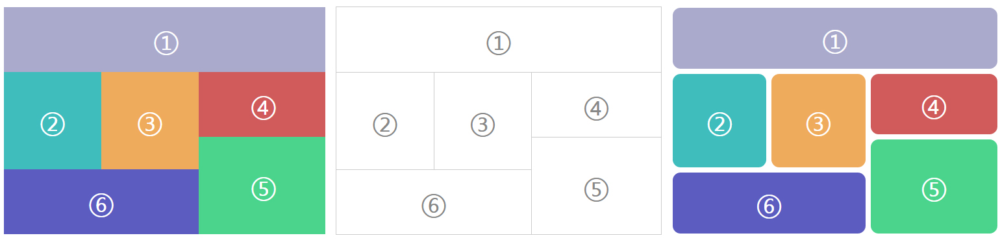

# 二维网格布局



支持复杂情况下的二维布局。

布局原理参考：[实现网格布局组件](https://github.com/Hanks10100/blog/blob/master/%E5%AE%9E%E7%8E%B0React%E7%BD%91%E6%A0%BC%E5%B8%83%E5%B1%80%E7%BB%84%E4%BB%B6.md)

## 使用方法

在 `dist` 目录中的 `grid.jquery.js`，是已经封装好了的 jQuery 插件，新增了 `wrapGrid` 方法。`grid.react.js` 是封装好的 React 无状态组件。详细使用方法参考 `demo` 目录中的例子。

### jQuery 插件使用方法
```html
<div id="grid">
    <div>&#9312;</div>
    <div>&#9313;</div>
    <div>&#9314;</div>
    <div>&#9315;</div>
    <div>&#9316;</div>
    <div>&#9317;</div>
</div>
```

```js
$('#grid').wrapGrid({
    width: 500,
    column: 10,
    layout: [[10,2], [3,3], [3,3], [4,2], [4,3], [6,2]],
});
```

### React 组件使用方法

```js
var layout = [[10,2], [3,3], [3,3], [4,2], [4,3], [6,2]];
ReactDOM.render(
    <GridLayout width={500}, column={10}, layout={layout}>
        <div>1</div>
        <div>2</div>
        <div>3</div>
        <div>4</div>
        <div>5</div>
        <div>6</div>
    </GridLayout>,
    document.getElementById('grid')
)
```

其中 `layout` 参数表示所有网格的宽高构成的数组，第一个数为横向长度，第二个为纵向长度。

### 详细参数说明

```js
var props = {
    width: 500,       // [必需] 网格容器的真实宽度
    unit: 'px',       // 真实宽度、高度的单位，默认为 px
    column: 10,       // [必需] 网格容器的虚拟宽度（列数），每个网格的列数都以此为参考
    layout: [         // [必需] 网格布局配置
        [10, 2]           // 由网格宽高构成的数组，[宽度, 高度]
    ],
    gap: 0,           // 网格之间的空隙，默认为 0
    border: {         // 网格直接的分界线（边框），默认值如下：
        width: 0,
        style: 'solid',
        color: '#000',
        radius: '',
    }
}
```
